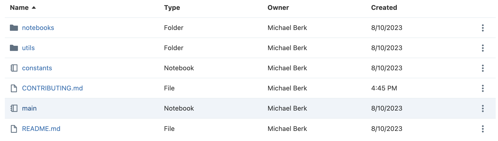
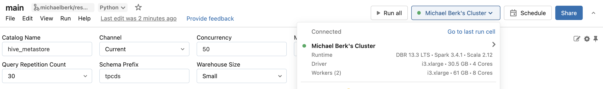
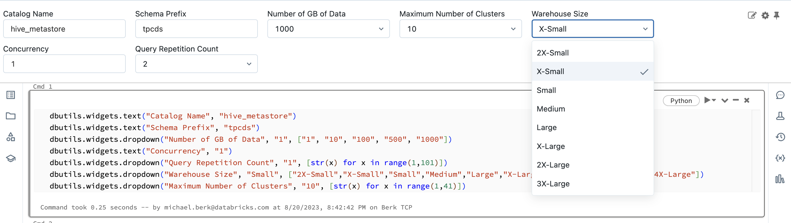
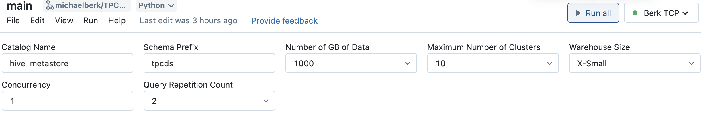
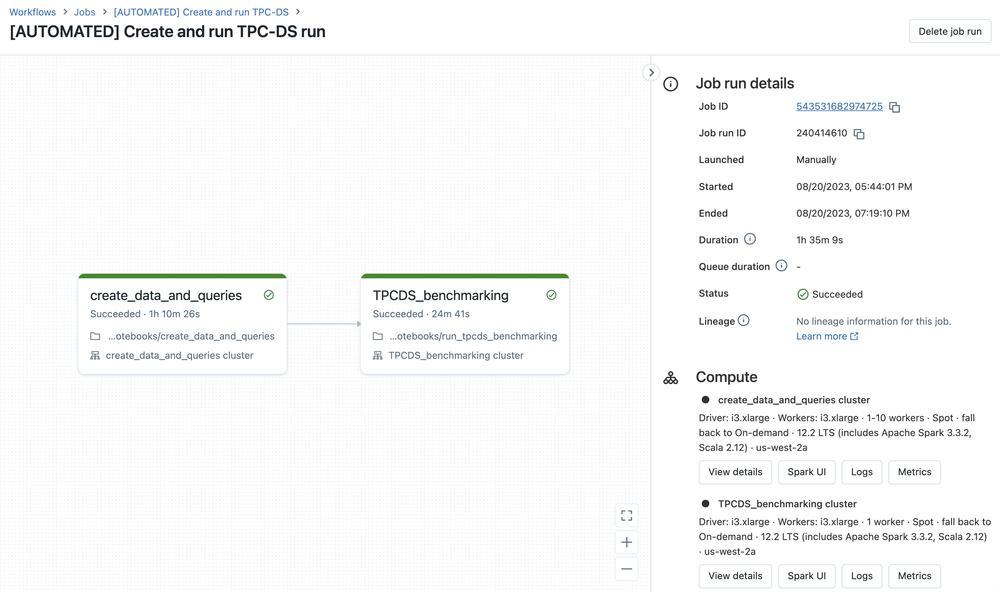

# Databricks TPC-DS Benchmarking Tool

This tool runs the TPC-DS benchmark on a Databricks SQL warehouse. The TPC-DS benchmark is a standardised method of evaluating the performance of decision support solutions, such as databases, data warehouses, and big data systems.

**Disclaimer: this tool is simple. It will not duplicate warehouse peak performance out-of-the-box. Instead, it's meant to be a transparent and representative baseline.**

## Quick Start
#### 0 - Clone this repo via [Databricks Repos](https://docs.databricks.com/en/repos/index.html)

#### 1 - Open the main notebook

#### 2 - Create or Attach to Cluster

Note that if you're using a unity catalog (UC) table, UC must be enabled on this cluster.
Note that we don't support serverless clusters at this time.

#### 3 - Run your parameters
* Note that you may have to run the first cell in the notebook to see the widgets. 

## Parameters
Data
* **Catalog Name**: the name of the catalog to write to for non-UC configurations
* **Schema Prefix**: a string that will be prepended to the dynamically-generated schema name
* **Number of GB of Data**: the number of gigabytes of TPC-DS data to be written. `1` indicates that the sum of all table sizes will be ~1GB. 

Warehouse
* **Maximum Number of Clusters**: the maximum number of workers to which a SQL warehouse can scale
* **Warehouse Size**: T-shirt size of the SQL warehouse workers
* **Channel**: the warehouse channel, which correspond to the underlying DBR version

Load Testing
* **Concurrency**: the simulated number of users executing the TPC-DS queries. On the backend, this corresponds to the number of Python threads.
* **Query Repeatition Count**: the number of times the TPC-DS queries will be repeatedly run. `2` indicates that each TPC-DS query will be run twice. Note that caching is disabled, so repeated queries will not hit cache.

#### 4 - Click "Run All"

#### What will happen?
After clicking run all, a Databricks workflow with two tasks will be created. The first task is responsible for writing TPC-DS data and the associated queries into Delta tables. The second task will execute a TPC-DS benchmark leveraging the tables and queries created in the prior task. The results of the bechmarking will be printed out in the job notebook for viewing, but also will be written to a delta table; the location of the delta table will be printed in the job notebook. 

## Core Concepts
- **Concurrency**: The simulated number of users executing concurrent queries. It provides an insight into how well the system can handle multiple users executing queries at the same time.
- **Throughput**: The number of queries that the system can handle per unit of time. It is usually measured in queries per minute (QPM) and provides insignt into the speed and efficiency of the system.

# Product Details
## Relevant Features
* The tool is cloud agnostic.
* Authentication is automatically handled by the python SDK.
* Benchmarking will be performed on the latest LTS DBR version.
* Result cache is hard-coded to false, which means that all queries will not hit a warehouse's cache.
* Each benchmark run will trigger a warehouse "warming," which is just a `SELECT *` on all TPC-DS tables. 
* Table format is hard-coded to delta. Data writes are currently hard-coded to DBR 12.2, so if there are updates in Delta with newer DBR versions, they will not be included. This decision was made because spark-sql-perf did not run on > 12.2 DBR as of 2023-08-10.
* A new warehouse will be created based on user parameters. If a warehouse with the same name exists, the benchmarking tool will use that existing warehouse.
* Given Python's Global Processing Lock (GIL), increasing the number of cores will have diminshing returns. To hide complexity from the user while also bounding cost, the concurrency parameter will scale cluster count linearly up to 100 cores, then stop. Concurrency > 100 however is still supported via multithreading - it will just run on a maximum of 100 cores. Based on our default node type, this will be 25 workers.
* We are using [Databricks python-sql-connector](https://docs.databricks.com/en/dev-tools/python-sql-connector.html) to execute queries, but we are not fetching the results. The python-sql-connector has a built-in feature that retries with backoff when rate limit errors occur. Due to this retry mechanism, the actual performance of the system may be slightly faster than what the benchmarking results indicate.
* If the data (with a given set of configs) already exists, it will not be overwritten. The matching logic simply uses the name of the schema, so if you change the `schema_prefix` (and that resulting schema is not found), new data will be written.

### Limitations
* You must run this tool from a single-user cluster to allow default SDK authentication. 
* We currently don't support UC. That will be the next step for this tool.
* We currently only support DBSQL serverless warehouses for simplicity. If there is desire to test non-serverless warehouses, please let us know.

### Data Generation Runtimes
Both the data generation and benchmarking workflow tasks will increase in runtime as the data size increases. Here are some examples, however your benchmarking runtimes may differ signifigantly depending on your configurations.
| Number of GB Written | create_data_and_queries Runtime | TPCDS_benchmarking Runtime |
|---------|---------|---------|
| 1 GB | 17 mins | 7 mins |
| 100 GB | 70 mins | 24 mins |
| 1 TB | 305 mins | 54 mins |
